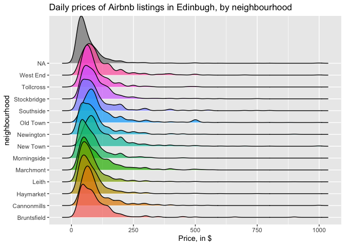

Edinburgh Inside Airbnb
================
9/18/2019

Recent development in Edinburgh regarding the growth of Airbnb and its
impact on the housing market means a better understanding of the Airbnb
listings is needed. Using data provided by Airbnb, we can explore how
Airbnb availability and prices vary by neighborhood.

The data come from the [Kaggle
database](https://www.kaggle.com/thoroc/edinburgh-inside-airbnb/version/2).

We’ll use the **tidyverse** and the **ggridges** packages for this
analysis.

``` r
library(tidyverse)
library(ggridges)
```

The dataset we’ll be working with is called `listings.csv`.

``` r
listings <- read_csv("data/listings.csv")
```

## Airbnb listing prices

There are 13245 observations in this dataset. We’ll start by visualizing
the price data.

``` r
ggplot(data = listings, mapping = aes(x = price)) +
  geom_histogram(binwidth = 50) +
  labs(
    title = "Daily prices of Airbnb listings in Edinbugh",
    x = "Price, in $"
    )
```

    ## Warning: Removed 199 rows containing non-finite values (stat_bin).

<!-- -->

There appears to be some really expensive listings\! What are they?

``` r
listings %>%
  arrange(desc(price)) %>%
  select(price, neighbourhood, accommodates, listing_url)
```

    ## # A tibble: 13,245 x 4
    ##    price neighbourhood accommodates listing_url                          
    ##    <dbl> <chr>                <dbl> <chr>                                
    ##  1   999 West End                 4 https://www.airbnb.com/rooms/5508519 
    ##  2   999 <NA>                     2 https://www.airbnb.com/rooms/10432576
    ##  3   999 <NA>                     1 https://www.airbnb.com/rooms/13930036
    ##  4   999 <NA>                     2 https://www.airbnb.com/rooms/18882037
    ##  5   999 <NA>                     2 https://www.airbnb.com/rooms/18914400
    ##  6   999 <NA>                     2 https://www.airbnb.com/rooms/19179102
    ##  7   999 Cannonmills              2 https://www.airbnb.com/rooms/24478301
    ##  8   999 New Town                 8 https://www.airbnb.com/rooms/33066249
    ##  9   999 New Town                10 https://www.airbnb.com/rooms/33067122
    ## 10   999 Old Town                12 https://www.airbnb.com/rooms/33067228
    ## # … with 13,235 more rows

## Prices by neighborhood

Next we plot the price distributions by neighborhood. The following
shows density plots for each neighbourhood. This representation is also
called a ridge plot.

``` r
ggplot(data = listings, 
       mapping = aes(x = price, y = neighbourhood, fill = neighbourhood)) +
  geom_density_ridges(alpha = 0.7, scale = 4) +
  guides(fill = "none") +
  labs(
    title = "Daily prices of Airbnb listings in Edinbugh, by neighbourhood",
    x = "Price, in $"
    )
```

    ## Warning: Removed 199 rows containing non-finite values
    ## (stat_density_ridges).

<!-- -->

We can also take a look at box plots.

And calculate summary statistics like number of listings, and mean and
median prices by neighborhood.
